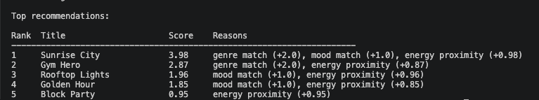
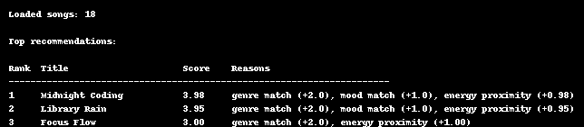
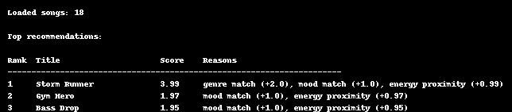
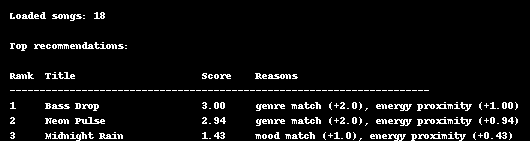

# 🎵 Music Recommender Simulation

## Project Summary

This project builds a content-based music recommender system in Python. It 
represents songs and a user taste profile as data, then uses a weighted scoring 
formula to rank songs by relevance and return personalized suggestions. The system 
loads an 18-song catalog from a CSV file, scores each song against the user's 
preferred genre, mood, and energy level, and prints the top 5 recommendations 
with explanations.

---

## How The System Works

Real-world recommenders like Spotify or TikTok predict what you'll enjoy next 
by either watching what similar users listen to, or by comparing the actual 
qualities of songs you've liked. This system uses the second approach — 
content-based filtering — matching song attributes directly to a user's taste 
profile.

Each **Song** is described by four qualities: its genre (like pop or lofi), its 
mood (like happy or chill), its energy level (how intense or calm it feels), and 
its tempo (how fast or slow it is).

Each **UserProfile** stores that person's preferred genre, preferred mood, and 
their ideal energy level.

The **Recommender** scores every song by checking how well it matches the user. 
A matching genre earns the most points (2), a matching mood earns slightly fewer 
(1), and songs whose energy is closest to the user's ideal earn bonus points 
between 0 and 1. All songs are ranked from highest to lowest score, and the top 
5 are returned as recommendations.

**Algorithm Recipe (finalized):**
- Genre match → +2.0 points
- Mood match → +1.0 point
- Energy proximity → 0 to 1 point (closer = more points, max score = 4.0)

**Potential biases:** This system may over-prioritize genre, meaning a high-energy 
pop song could outscore a perfectly mood-matched lofi track. Songs with no genre 
or mood match will rarely surface even if their energy is a perfect fit.

---

## Getting Started

### Setup

1. Create a virtual environment (optional but recommended):

```bash
   python -m venv .venv
   source .venv/bin/activate      # Mac or Linux
   .venv\Scripts\activate         # Windows
```

2. Install dependencies:

```bash
   pip install -r requirements.txt
```

3. Run the app:

```bash
   python -m src.main
```

### Running Tests

Run the starter tests with:

```bash
pytest
```

You can add more tests in `tests/test_recommender.py`.

---

## Experiments You Tried

### Profile 1: pop / happy / energy 0.8 (default)


The top result was Sunrise City (score 3.98) which matched on genre, mood, and 
energy. Gym Hero ranked second despite no mood match because the genre match 
(+2.0) outweighed everything else. Songs with no genre or mood match only 
appeared if their energy was very close to the target.

### Profile 2: lofi / chill / energy 0.4


Midnight Coding and Library Rain correctly ranked at the top with near-perfect 
scores. This profile produced the most intuitive results because lofi has 
multiple well-matched songs in the catalog.

### Profile 3: rock / intense / energy 0.9


Storm Runner ranked first correctly. However Gym Hero (pop/intense) appeared 
at #2 because its mood match (+1.0) combined with high energy proximity 
outscored other rock songs without a mood match. This shows genre weight alone 
does not always dominate.

### Profile 4: electronic / sad / energy 0.95 (edge case)


No songs matched both genre and mood simultaneously. The system fell back to 
genre and energy only, surfacing Bass Drop and Neon Pulse. Midnight Rain appeared 
at #3 purely on mood match despite being a country song — an emotionally correct 
but genre-wrong recommendation.

### Weight Shift Experiment

Doubling the energy weight and halving the genre weight caused Rooftop Lights to 
jump from #3 to #2 for the pop/happy profile. Songs with no genre match but close 
energy scores ranked significantly higher, showing how sensitive the system is to 
weight choices. This confirmed that the default weights create a genre-first 
recommender, which may not suit all users.

---

## Limitations and Risks

- The catalog is small (18 songs) and unevenly distributed across genres
- The system does not understand lyrics, language, or cultural context
- Genre weight dominates scoring, which can create a filter bubble
- Users whose preferred mood has no matching songs get emotionally wrong results
- All users are treated as having a single fixed taste — no mixed preferences

---

## Reflection

[**Model Card**](model_card.md)

Building this recommender made it clear how much a simple scoring formula shapes 
what gets recommended. Assigning genre a higher weight than mood means the system 
consistently surfaces genre-correct songs even when they feel emotionally wrong — 
which is exactly how filter bubbles form in real apps. A user who only ever gets 
pop recommendations will never discover that they might love jazz, simply because 
the algorithm never gives jazz a chance to score high enough.

The most surprising finding was the edge case experiment. A user who likes sad 
electronic music received recommendations that were genre-correct but emotionally 
mismatched, because our dataset has no sad electronic songs. This showed that 
real recommenders must handle gaps in their data gracefully, and that a small or 
biased dataset can make even a well-designed scoring system feel broken.